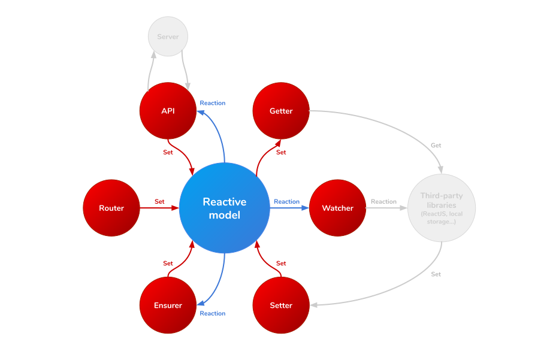

# Wu framework: API documentation
**API** allows you to watch changes in the data model and send Ajax requests to your server. When the server responses, **API** helps you manage it and save it in the data model.

### Data flow:
Reactive data model &#10148; API (pure functions) &#10148; Server &#10148; API (pure functions) &#10148; Reactive data model.

### API definition properties:
ToDo

### Example:
ToDo
