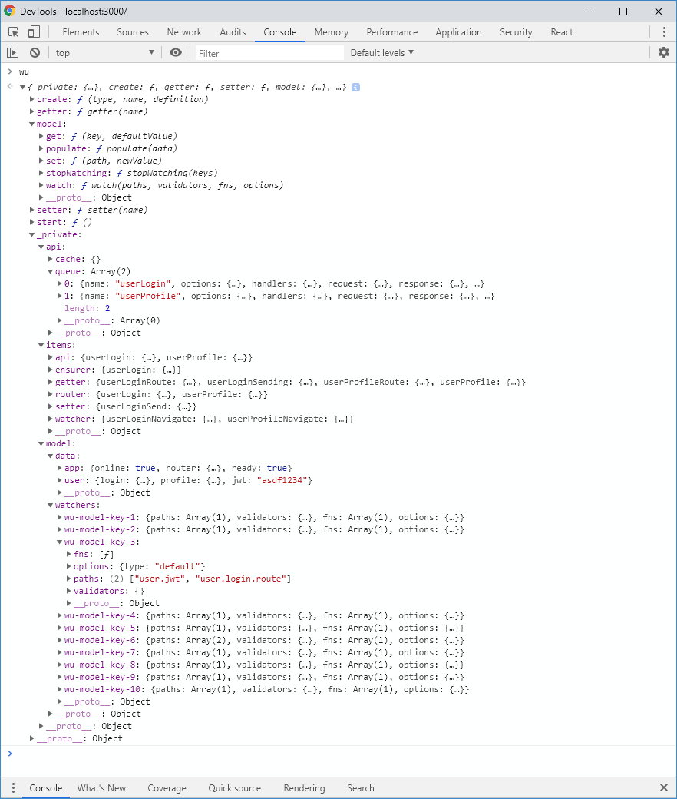
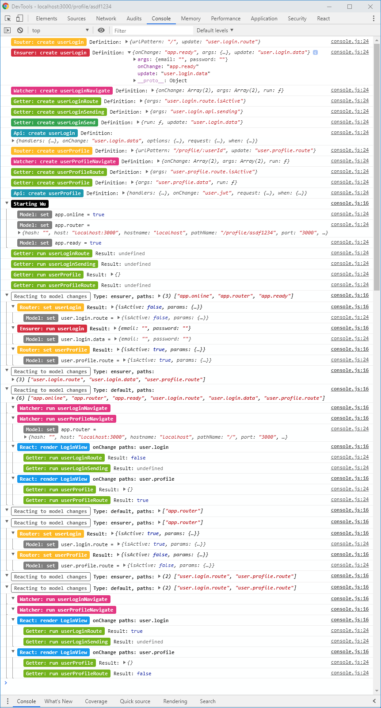

# Wu framework: console documentation

## Wu instance

In the **development environment**, the Wu value is published in the `window.wu` to facilitate development and debugging.

Wu's private properties are:

* `_private:`
  * `api:`
    * `cache:` Calls made through the API that have been cached by Wu.
    * `queue:` Current call list to the API and its status.
  * `items:` Items (APIs, ensurers, watchers, routers, getters and setters) defined in the application.
  * `model:`
    * `data:` Current data model.
    * `watchers:` List of elements that are watching some propertiesy of reactive model with its paths and validators (aka [`when`](./documentation-properties.md#when)).
    
**Wu's public methods** are documented [here](./documentation-wu.md).
    
Below is the result of the console of a small program that manages the user's profile and login.

## Wu flow

In order to improve the development experience, to facilitate debugging we have created a functionality
that shows in the browser console the elements that are executed,
with its variables and the elements that are reacting to other elements.

Below is the result of the console of a small program that manages the user's profile and login.

This functionality is optimized for Chrome and Firefox.

