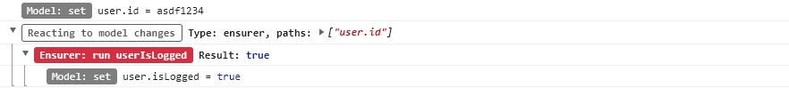

[Back to documentation](./README.md)

# Wu framework: Ensurer items (WIP)

**Ensurer** allows you to execute a function and save its result in the data model every time other data change. The goal is to always keep the data model consistent.

As you can see in the image, the **data flow is:** Reactive data model &#10148; Ensurer (pure function) &#10148; Reactive data model.

```javascript
wu.create('ensurer', 'userIsLogged', { // name of the ensurer item
  // path of the data model that we are watching
  onChange: 'user.id',
  // 'run' function will only be executed when the value of 'user.id' is a non-empty string
  when: {
    'user.id': [_.negate(_.isEmpty), _.isString]
  },
  // arguments that will receive the function 'run'
  args: 'user.id',
  // pure function that runs when 'onChange' has changed and 'when' conditions match
  run: (userId) => {
    return !!userId
  },
  // path of the data model where to save the result of 'run'
  update: 'user.isLogged'
})
```

### Console
When someone changes the value of **'user.id'** the developer tools console shows:



### Ensurer definition:

Ensure can be defined with the following properties:

| Properties | Type                       | Required |
| ---------- |----------------------------| ---------|
| `onChange` | String or Array of strings | Required |
| `when`     | Object                     | Optional |
| `args`     | *                          | Optional |
| `run`      | Pure function              | Optional |
| `update`   | String                     | Required |
