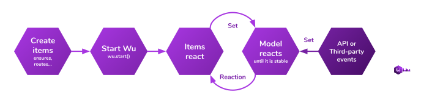

# Wu framework: How does it work?

## Wu flow:



### 1º Create items:

Wu is a reactive system. Therefore **you must create items** (ensurers, watchers, routers...) that **will react after the actions of other items**.

### 2º Start Wu:

When you have created all your items **you must start Wu** using the function [`wu.start()`](./documentation-public-methods.md#wustart).
This method updates the model `app.ready = true` so that your items begin to react.

### 3º Everything reacts:

The created **items will be executed and will react** to the changes of other items.

### 4º Stable model:

Once the **model is stable and coherent, the items will stop reacting**. Wu will wait for something to happen, such as a change from the view or a response from the server. When this happens, everything will react until the model is stable again.

### ToDo list example:

```javascript
import wu from 'wu'

// when 'app.ready' is true
// 'todos' model property is { items: [], filter: 'all' }
wu.create('ensurer', 'initToDosData', {
  onChange: 'app.ready',
  when: {
    'app.ready': _.isTrue
  },
  run: () => ({
    items: [],
    filter: 'all'
  }),
  update: 'todos'
})

// when view executes "wu.setter('addTodo', 'Buy fruit')"
// 'todos.items' model property is [ { text: 'Buy fruit', completed: false } ]
wu.create('setter', 'addTodo', {
  args: ['todos.items'],
  run: (items, newItem) => {
    if (newItem) {
      items.push({
        text: newItem,
        completed: false
      })
    }
    return items
  },
  update: 'todos.items'
})

// when view executes "wu.setter('setFilter', 'completed')"
// 'todos.filter' model property is 'completed'
wu.create('setter', 'setFilter', {
  update: 'todos.filter'
})

// when view executes "wu.setter('toggleItem', 0)"
// 'todos.items' model property is [ { text: 'Buy fruit', completed: true } ]
wu.create('setter', 'toggleItem', {
  args: ['todos.items'],
  run: (items, itemIndex) => {
    items[itemIndex].completed = !items[itemIndex].completed
    return items
  },
  update: 'todos.items'
})

// when view executes "wu.getter('getItems')"
// this method returns [ { text: 'Buy fruit', completed: true, visible: true } ]
wu.create('getter', 'getItems', {
  args: ['todos.items', 'todos.filter'],
  run: (items, filter) => {
    items = items || []
    return items.map((item) => {
      if (filter === 'all') {
        item.visile = true
      } else if (filter === 'completed') {
        item.visible = item.completed === true
      } else {
        item.visible = item.completed === false
      }
      return item
    })
  }
})

// start Wu so that all items start to react
wu.start()
```
___
## Important concepts:

**Your only goal** as a developer is:

1. Create a **good, logical data model** that matches your business model.
2. Create elements that are **responsible for maintaining that consistent model**.

Normally applications have **large and complex flow trees** in which there are many decisions.
**With Wu those flow trees are reduced** in small individual and independent decisions.
